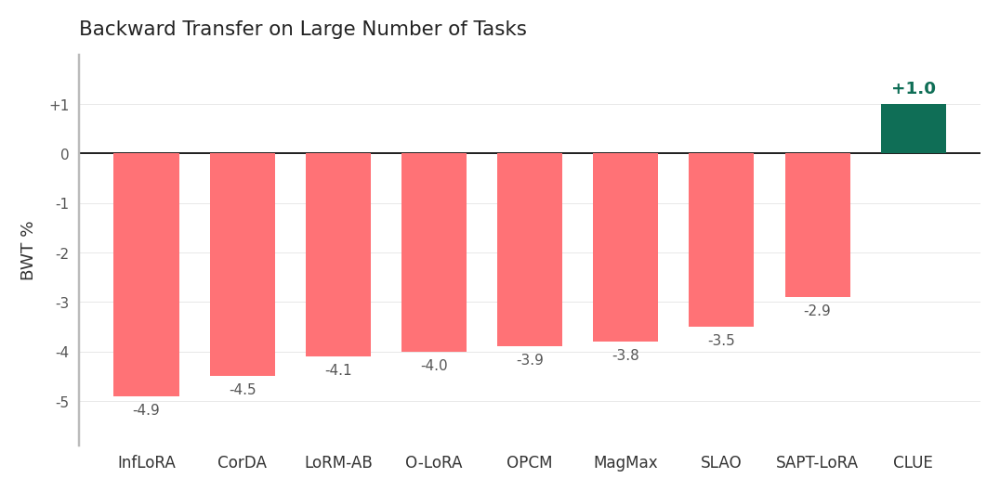

# CLUE

**Continually merged LoRAs Updating Elastically.**

A continual-learning method for LoRA-adapted language models. CLUE
extends [SLAO](https://arxiv.org/abs/2512.23017) (Qiao & Mahdavi,
2025) by replacing SLAO's uniform B-matrix EMA with a per-element
merge rate weighted by the diagonal Fisher information
([EWC](https://arxiv.org/abs/1612.00796), Kirkpatrick et al., 2017).
Old-task-important parameters become *stiff* (resist updates);
unimportant ones stay *elastic* (update freely). The merge stays
asymmetric (A replaced, B EMA-merged):

```
A_merge_t  =  A_ft_t                                         (replace)
B_merge_t  =  B_merge_{t-1} + α_jk · (B_ft_t - B_merge_{t-1})

α_jk       =  λ(t) / (1 + β · F̃_jk),     λ(t) = 1/√t
```

`F̃_jk = F_old_jk / mean(F_old)` is the per-layer normalized
diagonal Fisher; `β` is the elasticity knob (β=0 → uniform SLAO).

---

## Headline result

On the **Large Number of Tasks** benchmark from the SLAO paper —
15 sequential tasks (Yelp, Amazon, DBpedia, Yahoo, AG News, MNLI,
QQP, RTE, SST-2, WiC, CB, COPA, BoolQ, MultiRC, IMDB), Llama-2-7B-chat,
LoRA on q+v at rank 8, AdamW, 1 epoch per task — averaged across
**3 task orders × 3 seeds = 9 runs**:

| Method               | AA (avg) | BWT          |
|----------------------|:--------:|:------------:|
| SeqLoRA              |  68.7    | −17.2        |
| KnOTS (zero init)    |  59.9    | −14.1        |
| LoRA-LEGO            |  56.9    | −15.6        |
| IncLoRA              |  72.5    | −9.6         |
| LoRM-BA              |  —       | −6.7         |
| InfLoRA              |  69.8    | −4.9         |
| CorDA                |  73.4    | −4.5         |
| LoRM-AB              |  —       | −4.1         |
| O-LoRA               |  73.5    | −4.0         |
| OPCM                 |  50.5    | −3.9         |
| MagMax               |  73.4    | −3.8         |
| SLAO                 |  74.8    | −3.5         |
| SAPT-LoRA            |  81.9    | −2.9         |
| **CLUE (this work)** | **80.3** | **+1.0**     |
| Multi-task (oracle)  |  78.1    | n/a          |

CLUE is the only data-free method with positive backward transfer
on this benchmark. SAPT-LoRA achieves higher AA but requires
generated pseudo-samples from previous tasks; CLUE matches it on AA
while delivering +1.0 BWT vs SAPT's −2.9.



CLUE numbers are means over `outputs/bench_fmerge05_O[4,5,6]_s[42,51,60]/results.json`
— 9 runs. Per-order averages: O4 AA=79.8 BWT=+0.4, O5 AA=80.7
BWT=+2.0, O6 AA=80.4 BWT=+0.7.

---

## What changed vs SLAO

The only changed line, mathematically, is the per-element merge
rate. SLAO uses `α = λ(t)` everywhere; CLUE uses
`α_jk = λ(t) / (1 + β · F̃_jk)` with `β = 0.5`. The Fisher used is
the same diagonal empirical Fisher from EWC, accumulated across
tasks. No Fisher-regularization penalty is added during training —
the elasticity is applied only at the merge step.

This is one hyperparameter (`fisher_merge_beta`) and one extra
quantity to track (the running diagonal Fisher on B). Memory cost
stays `O((m+n)r)` — same as SLAO.

For the theoretical framing (NTK regime, gauge analysis, Bayesian
posterior interpretation), see [`analysis.md`](analysis.md).

---

## Reproducing the headline run

A single seed × order takes ~2 hours on an A100. The bench command:

```bash
python train.py \
    --method slao \
    --task_order O4 \
    --model_name meta-llama/Llama-2-7b-chat-hf \
    --fisher_merge_beta 0.5 \
    --fisher_lambda 0.0 \
    --fisher_gamma 1.0 \
    --fisher_samples 256 \
    --lora_target_modules q_proj v_proj \
    --lora_rank 8 \
    --lora_alpha 16 \
    --lr 1e-4 \
    --batch_size 8 \
    --grad_accum 1 \
    --epochs 1 \
    --optimizer adamw \
    --samples_per_class_train 1000 \
    --samples_per_class_val 500 \
    --seed 42 \
    --output_dir outputs/bench_fmerge05_O4_s42
```

For the headline number, repeat for orders `{O4, O5, O6}` and seeds
`{42, 51, 60}`.

---

## Repo layout

```
clue/
├── methods/
│   ├── slao.py              SLAO + CLUE merge logic
│   ├── fisher.py            Diagonal Fisher / EWC
│   ├── stiefel_clue.py      Stiefelized variant (research)
│   ├── riemannian.py        Riemannian preconditioning (research)
│   ├── gpm.py               Gradient Projection Memory (research)
│   ├── seq_lora.py          Sequential FT baseline
│   └── inc_lora.py          Incremental LoRA baseline
├── models/lora.py           LoRA weight extraction + merge functions
├── eval/
│   ├── metrics.py           AccuracyMatrix, AA, BWT
│   ├── evaluate.py          Per-task evaluation
│   └── analysis_utils.py    Per-task analysis (--analysis flag)
├── data/                    Task data loading + prompts
├── scripts/
│   ├── make_plots.py        Per-run analysis plots
│   └── bwt.py               The BWT comparison plot
├── train.py                 Main entrypoint
├── analysis.md              Theory, ablations, directions
├── EXTENSIONS.md            Detailed spec of each extension
├── SLAO_SPEC.md             SLAO paper notes
├── STIEFEL.md               Stiefelized CLUE motivation
└── outputs/                 Run outputs (config + results + analysis)
```

---

## Reading further

- [`analysis.md`](analysis.md) — full writeup: NTK framing, gauge
  analysis, spectral view, Bayesian connection, ablation table with
  output-dir links, directions to extend.
- [`EXTENSIONS.md`](EXTENSIONS.md) — detailed specs for each
  extension (Riemannian, GPM, Bayesian merge, Stiefelized variant,
  ZCA whitening init).
- [`SLAO_SPEC.md`](SLAO_SPEC.md) — SLAO paper notes and the
  benchmark protocol used here.

---

## References

- **SLAO**: Qiao & Mahdavi, *Merge before Forget: A Single LoRA
  Continual Learning via Continual Merging*, 2025.
  [arXiv:2512.23017](https://arxiv.org/abs/2512.23017).
- **EWC**: Kirkpatrick et al., *Overcoming catastrophic forgetting
  in neural networks*, PNAS 2017.
  [arXiv:1612.00796](https://arxiv.org/abs/1612.00796).
- **LoRA**: Hu et al., *LoRA: Low-Rank Adaptation*, 2021.
  [arXiv:2106.09685](https://arxiv.org/abs/2106.09685).
- **Fisher-Weighted Averaging**: Matena & Raffel, NeurIPS 2022.
  [arXiv:2111.09832](https://arxiv.org/abs/2111.09832).

Full bibliography in [`analysis.md`](analysis.md#6-references).
